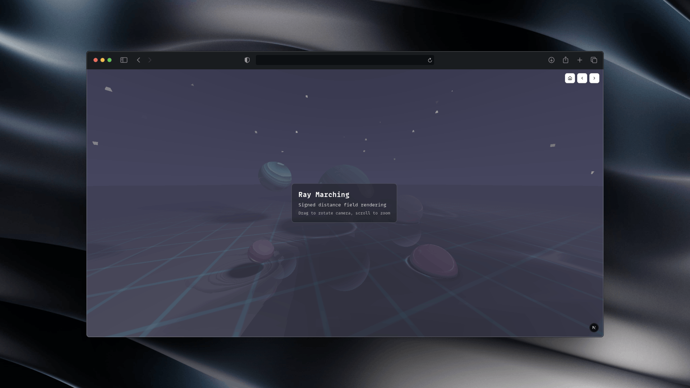
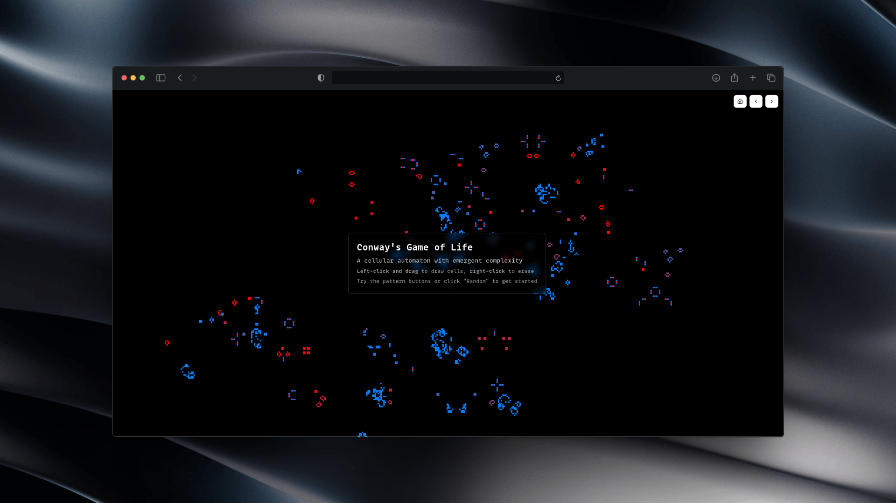

# OGL Effects Showcase

A collection of interactive, real-time visual effects built with [OGL](https://github.com/oframe/ogl). 

It is based on [Kickstart Three.js](https://github.com/feremabraz/kickstart-threejs) so I can be sure they work well in a potentialy large project (no lag and so on).

## Effects Gallery

- Metaballs
- Reaction-Diffusion
- CRT/Video Distortion
- Waves
- Game Terminal
- Falling Sand
- Matrix
- Ray Marching
- Voronoi Flow
- Pixel Fire
- Pixel People
- Game of Life
- Pixel Landscape
